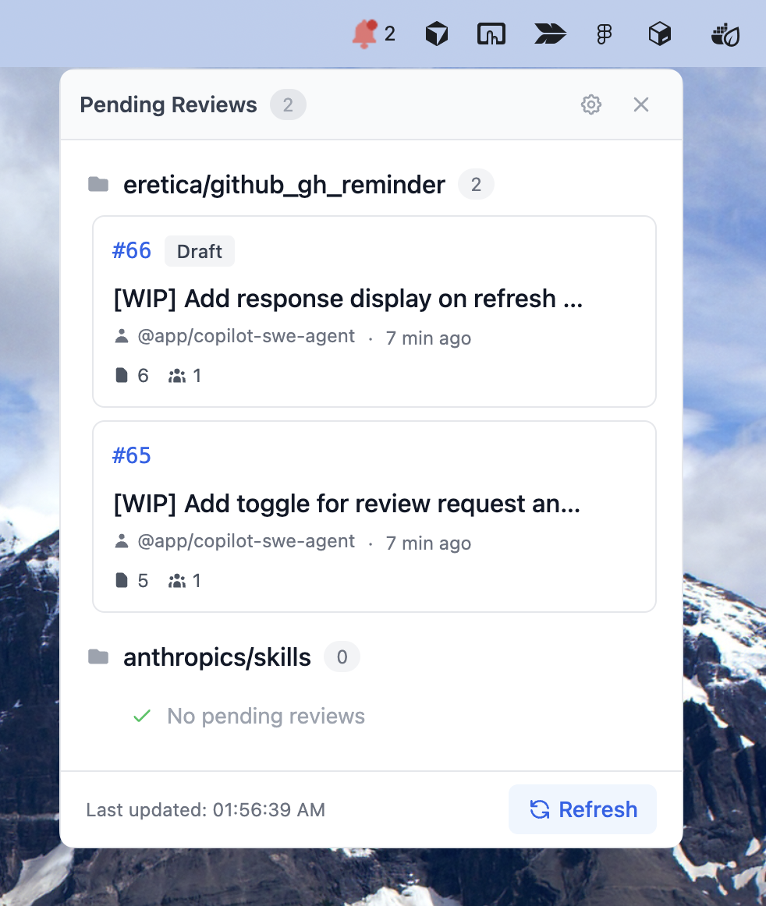
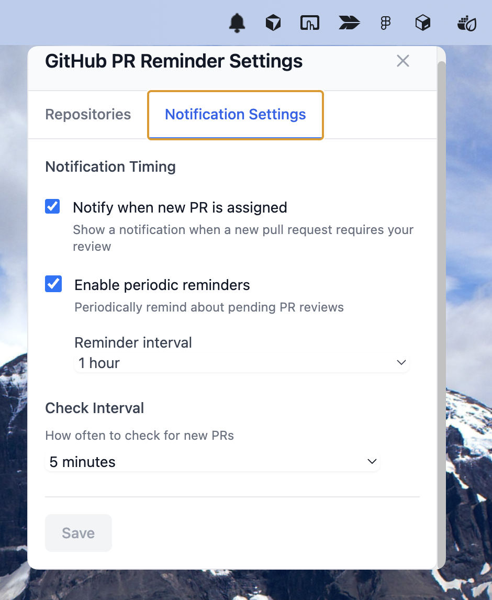

# GitHub PR Reminder

[日本語README.md](README.ja.md)

<p align="center">
  
</p>

A system tray application that monitors GitHub Pull Request review requests and sends desktop notifications.
Uses GitHub CLI (gh) authentication, so no app-specific authentication setup is required.

## Tech Stack

- **Electron** - Cross-platform desktop application framework
- **React + TypeScript** - Type-safe UI development
- **TailwindCSS** - Utility-first styling
- **Drizzle ORM + Better-SQLite3** - Local database storage
- **GitHub CLI** - GitHub API integration

## Features

- 🔔 **Automatic PR Monitoring** - Automatically detects PRs requesting your review and sends desktop notifications
- 📋 **Multiple Repository Management** - Register and monitor multiple repositories at once
- ⏰ **Reminder Notifications** - Periodic reminder notifications to prevent missing reviews
- 🔐 **Simple Authentication** - Uses GitHub CLI authentication, no app-specific setup required


| Main View | Setting View |
| --- | --- |
|  |  |

## Installation

### Download

Download the latest version from [Releases](https://github.com/eretica/github_gh_reminder/releases).

Platform-specific builds are available:
- **macOS**: `.dmg` file

### Bypass macOS Gatekeeper (First Launch)

On macOS, if the app is unsigned, you may see a security warning on first launch. You can bypass this with the following command:

```bash
xattr -c /Applications/GitHub\ PR\ Reminder.app
```

Or, for the downloaded dmg file:

```bash
xattr -c ~/Downloads/github-pr-reminder-*.dmg
```

Then open the application normally.

## Setup

### 1. Install and Authenticate GitHub CLI

Before using the app, install and authenticate GitHub CLI (`gh` command).

**Installation**

macOS:
```bash
brew install gh
```

For other platforms, see the [GitHub CLI official site](https://cli.github.com/).

**Authentication**
```bash
gh auth login
```

### 2. Initial Configuration

Launch the app and select "Open Settings" from the system tray icon.

**Add Repositories**
1. Click "Add Repository" in the "Repositories" tab
2. Select a local Git repository folder
3. The registered repository will be monitored automatically

<!-- Screenshot: Add Repository -->

**Configure Notifications**
- Check interval: How often to check for PRs (5-60 minutes)
- Reminders: Enable/disable periodic notifications and set interval (1-24 hours)

<!-- Screenshot: Settings screen -->

## Usage

Click the system tray icon to see a list of PRs requesting your review. Click on a PR item to open it in your browser.

<!-- Screenshot: PR list in tray menu -->

## License

MIT

## Contributing

Bug reports and feature requests are welcome via [Issues](https://github.com/eretica/github_gh_reminder/issues).

## Support

If you encounter issues:
1. Verify GitHub CLI is correctly installed (`gh --version`)
2. Verify GitHub CLI is authenticated (`gh auth status`)
3. Verify the registered repository path is correct
4. If the issue persists, create an [Issue](https://github.com/eretica/github_gh_reminder/issues)
